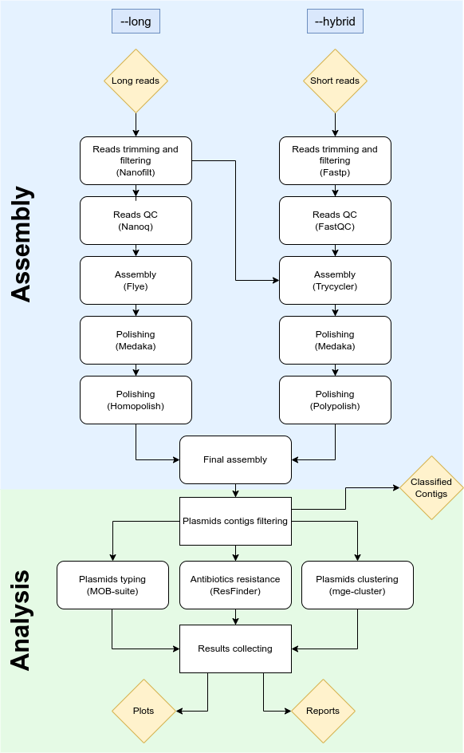

### PlasAMR

PlasAMR is a sequencing pipeline that can provide plasmids detection and typing from either raw Nanopore reads or hybrid Illumina-Nanopore reads.

This tool is under development. Do not use it.

To run this tool, you will need to install the latest version of nextflow (tested on version 22.04.3) and an installation of Singularity (tested on singularity version 3.7.1)

More info on the installation of these tools can be found here:

https://www.nextflow.io/docs/latest/getstarted.html

https://sylabs.io/guides/3.0/user-guide/installation.html

Once those two dependencies have been installed, clone the directory. 

```
git clone -b plasmids https://github.com/metagenlab/MASRES.git

```

Now you have have all you need to start running PlasAMR

PlasAMR offers two modes for the genome assembly: "long" for long read assemblies using Oxford Nanopore and "hybrid" for both Illumina and Oxford Nanopore.
It is highly suggested to use the "long" mode only with high accuracy Nanopore reads (R10.4.1, V14 chemistry, basecalled with SUP model using Dorado)

## Overview of workflow



## Example of command:

To get help documentation:

nextflow run main.nf --help

To run a hybrid assembly:

nextflow run main.nf --reads_csv samples_hybrid.csv --outdir results_hybrid --threads 10 --mode hybrid

TO run long read assembly:

nextflow run main.nf --reads_csv samples_long.csv --outdir results_long --threads 10 --mode long
